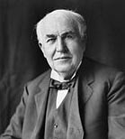
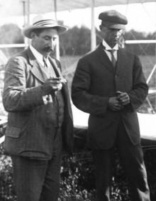

<h2> Top 10 inventors of all time </h2>

<a href="https://en.wikipedia.org/wiki/Thomas_Edison"><strong>Thomas Edison</strong></a>

<strong>Thomas Alva Edison</strong>&nbsp;(February 11, 1847&nbsp;&ndash; October 18, 1931) was an American inventor and businessman who has been described as America's greatest inventor.&nbsp;He developed many devices in fields such as&nbsp;<a title="Electricity generation" href="https://en.wikipedia.org/wiki/Electricity_generation">electric power generation</a>,&nbsp;<a title="Mass communication" href="https://en.wikipedia.org/wiki/Mass_communication">mass communication</a>,&nbsp;<a class="mw-redirect" title="Sound recording" href="https://en.wikipedia.org/wiki/Sound_recording">sound recording</a>, and motion pictures.&nbsp;These inventions, which include the&nbsp;<a title="Phonograph" href="https://en.wikipedia.org/wiki/Phonograph">phonograph</a>, the&nbsp;<a title="Movie camera" href="https://en.wikipedia.org/wiki/Movie_camera">motion picture camera</a>, and the long-lasting, practical electric&nbsp;<a title="Incandescent light bulb" href="https://en.wikipedia.org/wiki/Incandescent_light_bulb">light bulb</a>, have had a widespread impact on the modern&nbsp;<a title="Industrial society" href="https://en.wikipedia.org/wiki/Industrial_society">industrialized world</a>.&nbsp;He was one of the first inventors to apply the principles of organized science and teamwork to the process of invention, working with many researchers and employees. He established the first industrial&nbsp;<a class="mw-redirect" title="Research laboratory" href="https://en.wikipedia.org/wiki/Research_laboratory">research laboratory</a>.

Edison was raised in the American&nbsp;<a class="mw-redirect" title="Midwest" href="https://en.wikipedia.org/wiki/Midwest">Midwest</a>; early in his career he worked as a&nbsp;<a class="mw-redirect" title="Telegraph operator" href="https://en.wikipedia.org/wiki/Telegraph_operator">telegraph operator</a>, which inspired some of his earliest inventions.&nbsp;In 1876, he established his first laboratory facility in&nbsp;<a title="Menlo Park, New Jersey" href="https://en.wikipedia.org/wiki/Menlo_Park,_New_Jersey">Menlo Park, New Jersey</a>, where many of his early inventions were developed. He later established a&nbsp;<a title="Botany" href="https://en.wikipedia.org/wiki/Botany">botanic</a>&nbsp;laboratory in&nbsp;<a title="Fort Myers, Florida" href="https://en.wikipedia.org/wiki/Fort_Myers,_Florida">Fort Myers, Florida</a>&nbsp;in collaboration with businessmen&nbsp;<a title="Henry Ford" href="https://en.wikipedia.org/wiki/Henry_Ford">Henry Ford</a>&nbsp;and&nbsp;<a class="mw-redirect" title="Harvey Firestone" href="https://en.wikipedia.org/wiki/Harvey_Firestone">Harvey Firestone</a>, and a laboratory in&nbsp;<a title="West Orange, New Jersey" href="https://en.wikipedia.org/wiki/West_Orange,_New_Jersey">West Orange, New Jersey</a>&nbsp;that featured the world's first&nbsp;<a title="Film studio" href="https://en.wikipedia.org/wiki/Film_studio">film studio</a>, the&nbsp;<a title="Edison's Black Maria" href="https://en.wikipedia.org/wiki/Edison%27s_Black_Maria">Black Maria</a>. He was a&nbsp;<a title="List of prolific inventors" href="https://en.wikipedia.org/wiki/List_of_prolific_inventors">prolific inventor</a>, holding 1,093&nbsp;<a title="List of Edison patents" href="https://en.wikipedia.org/wiki/List_of_Edison_patents">US patents in his name</a>, as well as patents in other countries. Edison married twice and fathered six children. He died in 1931 of complications of&nbsp;<a title="Diabetes" href="https://en.wikipedia.org/wiki/Diabetes">diabetes</a>.

 
<h2> Books </h2>

<ul>

                             

 <li><a target="_blank" href="https://github.com/manjunath5496/Top-10-inventors-of-all-time/blob/master/hgk(1).pdf" style="text-decoration:none;">The Diary of Thomas Alva Edison</a></li>

 </ul>

 

<a href="https://en.wikipedia.org/wiki/Wright_brothers"><strong>The Wright Brothers</strong></a>

The&nbsp;<strong>Wright brothers</strong>&mdash;<strong>Orville</strong>&nbsp;(August 19, 1871&nbsp;&ndash; January 30, 1948) and&nbsp;<strong>Wilbur</strong>&nbsp;(April 16, 1867&nbsp;&ndash; May 30, 1912)&mdash;were two American&nbsp;<a title="Aviation" href="https://en.wikipedia.org/wiki/Aviation">aviation</a>&nbsp;pioneers generally credited&nbsp;with inventing, building, and flying the world's first successful motor-operated&nbsp;<a title="Airplane" href="https://en.wikipedia.org/wiki/Airplane">airplane</a>. They made the first controlled, sustained flight of a powered,&nbsp;<a title="Aircraft" href="https://en.wikipedia.org/wiki/Aircraft#Heavier-than-air_%E2%80%93_aerodynes">heavier-than-air aircraft</a>&nbsp;with the&nbsp;<em><a title="Wright Flyer" href="https://en.wikipedia.org/wiki/Wright_Flyer">Wright Flyer</a></em>&nbsp;on December 17, 1903, 4&nbsp;mi (6&nbsp;km) south of&nbsp;<a title="Kitty Hawk, North Carolina" href="https://en.wikipedia.org/wiki/Kitty_Hawk,_North_Carolina">Kitty Hawk, North Carolina</a>. In 1904&ndash;05, the brothers developed their flying machine to make longer-running and more aerodynamic flights with the&nbsp;<a title="Wright Flyer II" href="https://en.wikipedia.org/wiki/Wright_Flyer_II">Wright Flyer II</a>, followed by the first truly practical&nbsp;<a title="Fixed-wing aircraft" href="https://en.wikipedia.org/wiki/Fixed-wing_aircraft">fixed-wing aircraft</a>, the&nbsp;<a title="Wright Flyer III" href="https://en.wikipedia.org/wiki/Wright_Flyer_III">Wright Flyer III</a>. The Wright brothers were also the first to invent&nbsp;<a title="Aircraft flight control system" href="https://en.wikipedia.org/wiki/Aircraft_flight_control_system">aircraft controls</a>&nbsp;that made fixed-wing&nbsp;<a class="mw-redirect" title="Powered flight" href="https://en.wikipedia.org/wiki/Powered_flight">powered flight</a>&nbsp;possible.

The brothers' breakthrough was their creation of a&nbsp;<a class="mw-redirect" title="Flight dynamics (aircraft)" href="https://en.wikipedia.org/wiki/Flight_dynamics_(aircraft)">three-axis control system</a>, which enabled the pilot to steer the aircraft effectively and to maintain its equilibrium.&nbsp;This method remains standard on fixed-wing aircraft of all kinds.&nbsp;From the beginning of their aeronautical work, the Wright brothers focused on developing a reliable method of pilot control as the key to solving "the flying problem". This approach differed significantly from other experimenters of the time who put more emphasis on developing powerful engines.&nbsp;Using a small home-built&nbsp;<a title="Wind tunnel" href="https://en.wikipedia.org/wiki/Wind_tunnel">wind tunnel</a>, the Wrights also collected more accurate data than any before, enabling them to design more efficient wings and propellers.&nbsp;Their first U.S. patent did not claim invention of a flying machine, but a system of aerodynamic control that manipulated a flying machine's surfaces.

The brothers gained the mechanical skills essential to their success by working for years in their&nbsp;<a title="Dayton, Ohio" href="https://en.wikipedia.org/wiki/Dayton,_Ohio">Dayton, Ohio</a>-based shop with printing presses, bicycles, motors, and other machinery. Their work with bicycles, in particular, influenced their belief that an unstable vehicle such as a flying machine could be controlled and balanced with practice.&nbsp;From 1900 until their first powered flights in late 1903, they conducted extensive&nbsp;<a title="Glider (aircraft)" href="https://en.wikipedia.org/wiki/Glider_(aircraft)#19th_century">glider tests</a>&nbsp;that also developed their skills as pilots. Their shop employee&nbsp;<a title="Charlie Taylor (mechanic)" href="https://en.wikipedia.org/wiki/Charlie_Taylor_(mechanic)">Charlie Taylor</a>&nbsp;became an important part of the team, building their first airplane engine in close collaboration with the brothers.

The Wright brothers' status as inventors of the airplane has been subject to counter-claims by various parties. Much controversy persists over the many&nbsp;<a title="Claims to the first powered flight" href="https://en.wikipedia.org/wiki/Claims_to_the_first_powered_flight">competing claims of early aviators</a>. Edward Roach, historian for the&nbsp;<a title="Dayton Aviation Heritage National Historical Park" href="https://en.wikipedia.org/wiki/Dayton_Aviation_Heritage_National_Historical_Park">Dayton Aviation Heritage National Historical Park</a>, argues that they were excellent self-taught engineers who could run a small company, but they did not have the business skills or temperament to dominate the growing aviation industry.

 

