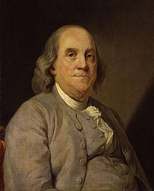
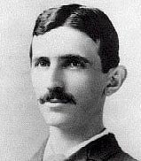
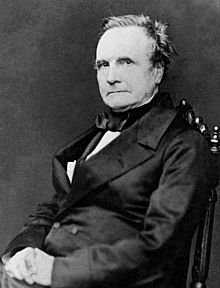
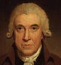
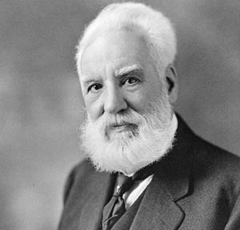
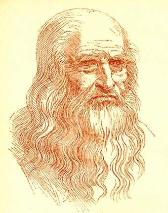

<h2> Top 10 inventors of all time </h2>

<a href="https://en.wikipedia.org/wiki/Thomas_Edison"><strong>Thomas Edison</strong></a>

<strong>Thomas Alva Edison</strong>&nbsp;(February 11, 1847&nbsp;&ndash; October 18, 1931) was an American inventor and businessman who has been described as America's greatest inventor.&nbsp;He developed many devices in fields such as&nbsp;<a title="Electricity generation" href="https://en.wikipedia.org/wiki/Electricity_generation">electric power generation</a>,&nbsp;<a title="Mass communication" href="https://en.wikipedia.org/wiki/Mass_communication">mass communication</a>,&nbsp;<a class="mw-redirect" title="Sound recording" href="https://en.wikipedia.org/wiki/Sound_recording">sound recording</a>, and motion pictures.&nbsp;These inventions, which include the&nbsp;<a title="Phonograph" href="https://en.wikipedia.org/wiki/Phonograph">phonograph</a>, the&nbsp;<a title="Movie camera" href="https://en.wikipedia.org/wiki/Movie_camera">motion picture camera</a>, and the long-lasting, practical electric&nbsp;<a title="Incandescent light bulb" href="https://en.wikipedia.org/wiki/Incandescent_light_bulb">light bulb</a>, have had a widespread impact on the modern&nbsp;<a title="Industrial society" href="https://en.wikipedia.org/wiki/Industrial_society">industrialized world</a>.&nbsp;He was one of the first inventors to apply the principles of organized science and teamwork to the process of invention, working with many researchers and employees. He established the first industrial&nbsp;<a class="mw-redirect" title="Research laboratory" href="https://en.wikipedia.org/wiki/Research_laboratory">research laboratory</a>.

Edison was raised in the American&nbsp;<a class="mw-redirect" title="Midwest" href="https://en.wikipedia.org/wiki/Midwest">Midwest</a>; early in his career he worked as a&nbsp;<a class="mw-redirect" title="Telegraph operator" href="https://en.wikipedia.org/wiki/Telegraph_operator">telegraph operator</a>, which inspired some of his earliest inventions.&nbsp;In 1876, he established his first laboratory facility in&nbsp;<a title="Menlo Park, New Jersey" href="https://en.wikipedia.org/wiki/Menlo_Park,_New_Jersey">Menlo Park, New Jersey</a>, where many of his early inventions were developed. He later established a&nbsp;<a title="Botany" href="https://en.wikipedia.org/wiki/Botany">botanic</a>&nbsp;laboratory in&nbsp;<a title="Fort Myers, Florida" href="https://en.wikipedia.org/wiki/Fort_Myers,_Florida">Fort Myers, Florida</a>&nbsp;in collaboration with businessmen&nbsp;<a title="Henry Ford" href="https://en.wikipedia.org/wiki/Henry_Ford">Henry Ford</a>&nbsp;and&nbsp;<a class="mw-redirect" title="Harvey Firestone" href="https://en.wikipedia.org/wiki/Harvey_Firestone">Harvey Firestone</a>, and a laboratory in&nbsp;<a title="West Orange, New Jersey" href="https://en.wikipedia.org/wiki/West_Orange,_New_Jersey">West Orange, New Jersey</a>&nbsp;that featured the world's first&nbsp;<a title="Film studio" href="https://en.wikipedia.org/wiki/Film_studio">film studio</a>, the&nbsp;<a title="Edison's Black Maria" href="https://en.wikipedia.org/wiki/Edison%27s_Black_Maria">Black Maria</a>. He was a&nbsp;<a title="List of prolific inventors" href="https://en.wikipedia.org/wiki/List_of_prolific_inventors">prolific inventor</a>, holding 1,093&nbsp;<a title="List of Edison patents" href="https://en.wikipedia.org/wiki/List_of_Edison_patents">US patents in his name</a>, as well as patents in other countries. Edison married twice and fathered six children. He died in 1931 of complications of&nbsp;<a title="Diabetes" href="https://en.wikipedia.org/wiki/Diabetes">diabetes</a>.

 
<h2> Books </h2>

<ul>

                             

 <li><a target="_blank" href="https://github.com/manjunath5496/Top-10-inventors-of-all-time/blob/master/hgk(1).pdf" style="text-decoration:none;">The Diary of Thomas Alva Edison</a></li>

 </ul>

 

<a href="https://en.wikipedia.org/wiki/Wright_brothers"><strong>The Wright Brothers</strong></a>

The&nbsp;<strong>Wright brothers</strong>&mdash;<strong>Orville</strong>&nbsp;(August 19, 1871&nbsp;&ndash; January 30, 1948) and&nbsp;<strong>Wilbur</strong>&nbsp;(April 16, 1867&nbsp;&ndash; May 30, 1912)&mdash;were two American&nbsp;<a title="Aviation" href="https://en.wikipedia.org/wiki/Aviation">aviation</a>&nbsp;pioneers generally credited&nbsp;with inventing, building, and flying the world's first successful motor-operated&nbsp;<a title="Airplane" href="https://en.wikipedia.org/wiki/Airplane">airplane</a>. They made the first controlled, sustained flight of a powered,&nbsp;<a title="Aircraft" href="https://en.wikipedia.org/wiki/Aircraft#Heavier-than-air_%E2%80%93_aerodynes">heavier-than-air aircraft</a>&nbsp;with the&nbsp;<em><a title="Wright Flyer" href="https://en.wikipedia.org/wiki/Wright_Flyer">Wright Flyer</a></em>&nbsp;on December 17, 1903, 4&nbsp;mi (6&nbsp;km) south of&nbsp;<a title="Kitty Hawk, North Carolina" href="https://en.wikipedia.org/wiki/Kitty_Hawk,_North_Carolina">Kitty Hawk, North Carolina</a>. In 1904&ndash;05, the brothers developed their flying machine to make longer-running and more aerodynamic flights with the&nbsp;<a title="Wright Flyer II" href="https://en.wikipedia.org/wiki/Wright_Flyer_II">Wright Flyer II</a>, followed by the first truly practical&nbsp;<a title="Fixed-wing aircraft" href="https://en.wikipedia.org/wiki/Fixed-wing_aircraft">fixed-wing aircraft</a>, the&nbsp;<a title="Wright Flyer III" href="https://en.wikipedia.org/wiki/Wright_Flyer_III">Wright Flyer III</a>. The Wright brothers were also the first to invent&nbsp;<a title="Aircraft flight control system" href="https://en.wikipedia.org/wiki/Aircraft_flight_control_system">aircraft controls</a>&nbsp;that made fixed-wing&nbsp;<a class="mw-redirect" title="Powered flight" href="https://en.wikipedia.org/wiki/Powered_flight">powered flight</a>&nbsp;possible.

The brothers' breakthrough was their creation of a&nbsp;<a class="mw-redirect" title="Flight dynamics (aircraft)" href="https://en.wikipedia.org/wiki/Flight_dynamics_(aircraft)">three-axis control system</a>, which enabled the pilot to steer the aircraft effectively and to maintain its equilibrium.&nbsp;This method remains standard on fixed-wing aircraft of all kinds.&nbsp;From the beginning of their aeronautical work, the Wright brothers focused on developing a reliable method of pilot control as the key to solving "the flying problem". This approach differed significantly from other experimenters of the time who put more emphasis on developing powerful engines.&nbsp;Using a small home-built&nbsp;<a title="Wind tunnel" href="https://en.wikipedia.org/wiki/Wind_tunnel">wind tunnel</a>, the Wrights also collected more accurate data than any before, enabling them to design more efficient wings and propellers.&nbsp;Their first U.S. patent did not claim invention of a flying machine, but a system of aerodynamic control that manipulated a flying machine's surfaces.

The brothers gained the mechanical skills essential to their success by working for years in their&nbsp;<a title="Dayton, Ohio" href="https://en.wikipedia.org/wiki/Dayton,_Ohio">Dayton, Ohio</a>-based shop with printing presses, bicycles, motors, and other machinery. Their work with bicycles, in particular, influenced their belief that an unstable vehicle such as a flying machine could be controlled and balanced with practice.&nbsp;From 1900 until their first powered flights in late 1903, they conducted extensive&nbsp;<a title="Glider (aircraft)" href="https://en.wikipedia.org/wiki/Glider_(aircraft)#19th_century">glider tests</a>&nbsp;that also developed their skills as pilots. Their shop employee&nbsp;<a title="Charlie Taylor (mechanic)" href="https://en.wikipedia.org/wiki/Charlie_Taylor_(mechanic)">Charlie Taylor</a>&nbsp;became an important part of the team, building their first airplane engine in close collaboration with the brothers.

The Wright brothers' status as inventors of the airplane has been subject to counter-claims by various parties. Much controversy persists over the many&nbsp;<a title="Claims to the first powered flight" href="https://en.wikipedia.org/wiki/Claims_to_the_first_powered_flight">competing claims of early aviators</a>. Edward Roach, historian for the&nbsp;<a title="Dayton Aviation Heritage National Historical Park" href="https://en.wikipedia.org/wiki/Dayton_Aviation_Heritage_National_Historical_Park">Dayton Aviation Heritage National Historical Park</a>, argues that they were excellent self-taught engineers who could run a small company, but they did not have the business skills or temperament to dominate the growing aviation industry.

 

<a href="https://en.wikipedia.org/wiki/Benjamin_Franklin"><strong>Benjamin Franklin</strong></a>

&nbsp;

<strong>Benjamin Franklin</strong>&nbsp;<a title="Fellow of the Royal Society" href="https://en.wikipedia.org/wiki/Fellow_of_the_Royal_Society">FRS</a>&nbsp;<a title="Fellow of the Royal Society of Arts" href="https://en.wikipedia.org/wiki/Fellow_of_the_Royal_Society_of_Arts">FRSA</a>&nbsp;<a class="mw-redirect" title="Fellow of the Royal Society of Edinburgh" href="https://en.wikipedia.org/wiki/Fellow_of_the_Royal_Society_of_Edinburgh">FRSE</a>&nbsp;(January 17, 1706 [<a title="Old Style and New Style dates" href="https://en.wikipedia.org/wiki/Old_Style_and_New_Style_dates">O.S.</a>&nbsp;January 6, 1706]&nbsp;&ndash; April 17, 1790) was an American&nbsp;<a title="Polymath" href="https://en.wikipedia.org/wiki/Polymath">polymath</a>&nbsp;and one of the&nbsp;<a title="Founding Fathers of the United States" href="https://en.wikipedia.org/wiki/Founding_Fathers_of_the_United_States">Founding Fathers</a>&nbsp;of the United States. Franklin was a leading&nbsp;<a title="Writer" href="https://en.wikipedia.org/wiki/Writer">writer</a>,&nbsp;<a title="Printer (publishing)" href="https://en.wikipedia.org/wiki/Printer_(publishing)">printer</a>,&nbsp;<a title="List of political philosophers" href="https://en.wikipedia.org/wiki/List_of_political_philosophers">political philosopher</a>,&nbsp;<a title="Politician" href="https://en.wikipedia.org/wiki/Politician">politician</a>,&nbsp;<a class="mw-redirect" title="Freemason" href="https://en.wikipedia.org/wiki/Freemason">Freemason</a>,&nbsp;<a title="Postmaster" href="https://en.wikipedia.org/wiki/Postmaster">postmaster</a>,&nbsp;<a title="Scientist" href="https://en.wikipedia.org/wiki/Scientist">scientist</a>,&nbsp;<a title="Inventor" href="https://en.wikipedia.org/wiki/Inventor">inventor</a>,&nbsp;<a title="Humorist" href="https://en.wikipedia.org/wiki/Humorist">humorist</a>,&nbsp;<a title="Civics" href="https://en.wikipedia.org/wiki/Civics">civic activist</a>,&nbsp;<a class="mw-disambig" title="Statesman" href="https://en.wikipedia.org/wiki/Statesman">statesman</a>, and&nbsp;<a title="Diplomat" href="https://en.wikipedia.org/wiki/Diplomat">diplomat</a>. As a scientist, he was a major figure in the&nbsp;<a title="American Enlightenment" href="https://en.wikipedia.org/wiki/American_Enlightenment">American Enlightenment</a>&nbsp;and the&nbsp;<a title="History of physics" href="https://en.wikipedia.org/wiki/History_of_physics">history of physics</a>&nbsp;for his discoveries and theories regarding&nbsp;<a title="Electricity" href="https://en.wikipedia.org/wiki/Electricity">electricity</a>. As an inventor, he is known for the&nbsp;<a title="Lightning rod" href="https://en.wikipedia.org/wiki/Lightning_rod">lightning rod</a>,&nbsp;<a title="Bifocals" href="https://en.wikipedia.org/wiki/Bifocals">bifocals</a>, and the&nbsp;<a title="Franklin stove" href="https://en.wikipedia.org/wiki/Franklin_stove">Franklin stove</a>, among other inventions.&nbsp;He founded many civic organizations, including the&nbsp;<a title="Library Company of Philadelphia" href="https://en.wikipedia.org/wiki/Library_Company_of_Philadelphia">Library Company</a>,&nbsp;<a title="Philadelphia" href="https://en.wikipedia.org/wiki/Philadelphia">Philadelphia</a>'s first&nbsp;<a title="Union Fire Company" href="https://en.wikipedia.org/wiki/Union_Fire_Company">fire department</a>&nbsp;and the&nbsp;<a title="University of Pennsylvania" href="https://en.wikipedia.org/wiki/University_of_Pennsylvania">University of Pennsylvania</a>.

Franklin earned the title of "The First American" for his early and indefatigable campaigning for&nbsp;<a title="Thirteen Colonies" href="https://en.wikipedia.org/wiki/Thirteen_Colonies">colonial unity</a>, initially as an author and spokesman in London for several colonies. As the first&nbsp;<a class="mw-redirect" title="United States Ambassador to France" href="https://en.wikipedia.org/wiki/United_States_Ambassador_to_France">United States Ambassador to France</a>, he exemplified the emerging American nation.&nbsp;Franklin was foundational in defining the American ethos as a marriage of the practical values of thrift, hard work, education, community spirit, self-governing institutions, and opposition to authoritarianism both political and religious, with the scientific and tolerant values of the&nbsp;<a title="Age of Enlightenment" href="https://en.wikipedia.org/wiki/Age_of_Enlightenment">Enlightenment</a>. In the words of historian&nbsp;<a title="Henry Steele Commager" href="https://en.wikipedia.org/wiki/Henry_Steele_Commager">Henry Steele Commager</a>, "In a Franklin could be merged the virtues of&nbsp;<a class="mw-redirect" title="Puritanism" href="https://en.wikipedia.org/wiki/Puritanism">Puritanism</a>&nbsp;without its defects, the illumination of the Enlightenment without its heat."&nbsp;To&nbsp;<a title="Walter Isaacson" href="https://en.wikipedia.org/wiki/Walter_Isaacson">Walter Isaacson</a>, this makes Franklin "the most accomplished American of his age and the most influential in inventing the type of society America would become."

Franklin became a successful newspaper editor and printer in Philadelphia, the leading city in the colonies, publishing the&nbsp;<em><a title="Pennsylvania Gazette" href="https://en.wikipedia.org/wiki/Pennsylvania_Gazette">Pennsylvania Gazette</a></em>&nbsp;at the age of 23.&nbsp;He became wealthy publishing this and&nbsp;<em><a title="Poor Richard's Almanack" href="https://en.wikipedia.org/wiki/Poor_Richard%27s_Almanack">Poor Richard's Almanack</a></em>, which he authored under the&nbsp;<a title="Pseudonym" href="https://en.wikipedia.org/wiki/Pseudonym">pseudonym</a>&nbsp;"Richard Saunders". After 1767, he was associated with the&nbsp;<em><a title="Pennsylvania Chronicle" href="https://en.wikipedia.org/wiki/Pennsylvania_Chronicle">Pennsylvania Chronicle</a></em>, a newspaper that was known for its revolutionary sentiments and criticisms of the policies of the&nbsp;<a title="Parliament of Great Britain" href="https://en.wikipedia.org/wiki/Parliament_of_Great_Britain">British Parliament</a>&nbsp;and&nbsp;<a title="The Crown" href="https://en.wikipedia.org/wiki/The_Crown">the Crown</a>.

He pioneered and was the first president of&nbsp;<a title="Academy and College of Philadelphia" href="https://en.wikipedia.org/wiki/Academy_and_College_of_Philadelphia">Academy and College of Philadelphia</a>&nbsp;which opened in 1751 and later became the&nbsp;<a title="University of Pennsylvania" href="https://en.wikipedia.org/wiki/University_of_Pennsylvania">University of Pennsylvania</a>. He organized and was the first secretary of the&nbsp;<a title="American Philosophical Society" href="https://en.wikipedia.org/wiki/American_Philosophical_Society">American Philosophical Society</a>&nbsp;and was elected president in 1769. Franklin became a national hero in America as an agent for several colonies when he spearheaded an effort in London to have the&nbsp;<a title="Parliament of Great Britain" href="https://en.wikipedia.org/wiki/Parliament_of_Great_Britain">Parliament of Great Britain</a>&nbsp;repeal the unpopular&nbsp;<a title="Stamp Act 1765" href="https://en.wikipedia.org/wiki/Stamp_Act_1765">Stamp Act</a>. An accomplished diplomat, he was widely admired among the French as American minister to Paris and was a major figure in the development of positive&nbsp;<a title="France&ndash;United States relations" href="https://en.wikipedia.org/wiki/France%E2%80%93United_States_relations">Franco-American relations</a>. His efforts proved vital for the&nbsp;<a title="American Revolution" href="https://en.wikipedia.org/wiki/American_Revolution">American Revolution</a>&nbsp;in securing shipments of crucial munitions from France.

He was promoted to deputy postmaster-general for the British colonies in 1753, having been Philadelphia postmaster for many years, and this enabled him to set up the first national communications network. During the&nbsp;<a title="American Revolution" href="https://en.wikipedia.org/wiki/American_Revolution">revolution</a>, he became the first&nbsp;<a title="United States Postmaster General" href="https://en.wikipedia.org/wiki/United_States_Postmaster_General">United States Postmaster General</a>. He was active in community affairs and colonial and state politics, as well as national and international affairs. From 1785 to 1788, he served as&nbsp;<a title="List of governors of Pennsylvania" href="https://en.wikipedia.org/wiki/List_of_governors_of_Pennsylvania">governor of Pennsylvania</a>. He initially owned and dealt in slaves but, by the late 1750s, he began arguing against&nbsp;<a title="Slavery" href="https://en.wikipedia.org/wiki/Slavery">slavery</a>&nbsp;and became an&nbsp;<a title="Abolitionism in the United States" href="https://en.wikipedia.org/wiki/Abolitionism_in_the_United_States">abolitionist</a>.

His life and legacy of scientific and political achievement, and his status as one of America's most influential Founding Fathers, have seen Franklin honored more than two centuries after his death on&nbsp;<a title="Franklin half dollar" href="https://en.wikipedia.org/wiki/Franklin_half_dollar">coinage</a>&nbsp;and the&nbsp;<a class="mw-redirect" title="United States one hundred-dollar bill" href="https://en.wikipedia.org/wiki/United_States_one_hundred-dollar_bill">$100 bill</a>,&nbsp;<a class="mw-redirect" title="USS Benjamin Franklin (SSBN-640)" href="https://en.wikipedia.org/wiki/USS_Benjamin_Franklin_(SSBN-640)">warships</a>, and&nbsp;<a title="List of places named for Benjamin Franklin" href="https://en.wikipedia.org/wiki/List_of_places_named_for_Benjamin_Franklin">the names of many towns</a>, counties, educational institutions, and corporations, as well as countless&nbsp;<a title="Benjamin Franklin in popular culture" href="https://en.wikipedia.org/wiki/Benjamin_Franklin_in_popular_culture">cultural references</a>.

<h2> Books </h2>

<ul>
 <li><a target="_blank" href="https://github.com/manjunath5496/Top-10-inventors-of-all-time/blob/master/hgk(2).pdf" style="text-decoration:none;">The Complete Works in Philosophy, Politics and Morals of the late Dr. Benjamin Franklin, [Vol 1]</a></li>

<li><a target="_blank" href="https://github.com/manjunath5496/Top-10-inventors-of-all-time/blob/master/hgk(3).pdf" style="text-decoration:none;">The Complete Works in Philosophy, Politics and Morals of the late Dr. Benjamin Franklin, [Vol 2]</a></li>
 <li><a target="_blank" href="https://github.com/manjunath5496/Top-10-inventors-of-all-time/blob/master/hgk(4).pdf" style="text-decoration:none;">The Complete Works in Philosophy, Politics and Morals of the late Dr. Benjamin Franklin, [Vol 3] </a></li>    
 
  <li><a target="_blank" href="https://github.com/manjunath5496/Top-10-inventors-of-all-time/blob/master/hgk(5).pdf" style="text-decoration:none;">Franklin's Way to Wealth</a></li>

 <li><a target="_blank" href="https://github.com/manjunath5496/Top-10-inventors-of-all-time/blob/master/hgk(6).pdf" style="text-decoration:none;">Fart Proudly: Writings of Benjamin Franklin You Never Read in School</a></li>

<li><a target="_blank" href="https://github.com/manjunath5496/Top-10-inventors-of-all-time/blob/master/hgk(7).pdf" style="text-decoration:none;">The Whistle</a></li>
 <li><a target="_blank" href="https://github.com/manjunath5496/Top-10-inventors-of-all-time/blob/master/hgk(8).pdf" style="text-decoration:none;">The Private Life of the Late Benjamin Franklin</a></li>  
 
 <li><a target="_blank" href="https://github.com/manjunath5496/Top-10-inventors-of-all-time/blob/master/hgk(9).pdf" style="text-decoration:none;">Apology for Printers, 10 June 1731</a></li>
 <li><a target="_blank" href="https://github.com/manjunath5496/Top-10-inventors-of-all-time/blob/master/hgk(10).pdf" style="text-decoration:none;">The Morals Of Chess</a></li>    
 
  <li><a target="_blank" href="https://github.com/manjunath5496/Top-10-inventors-of-all-time/blob/master/hgk(11).pdf" style="text-decoration:none;">Observations Concerning the Increase of Mankind</a></li>

 <li><a target="_blank" href="https://github.com/manjunath5496/Top-10-inventors-of-all-time/blob/master/hgk(12).pdf" style="text-decoration:none;">Franklin, Benjamin Father Abraham's speech</a></li>

<li><a target="_blank" href="https://github.com/manjunath5496/Top-10-inventors-of-all-time/blob/master/hgk(13).pdf" style="text-decoration:none;">Experiments and Observations on Electricity
made at Philadelphia in America</a></li>

<li><a target="_blank" href="https://github.com/manjunath5496/Top-10-inventors-of-all-time/blob/master/hgk(14).pdf" style="text-decoration:none;">The Electrical Writings of Benjamin Franklin and Friends</a></li>

<li><a target="_blank" href="https://github.com/manjunath5496/Top-10-inventors-of-all-time/blob/master/hgk(15).pdf" style="text-decoration:none;">Poor Richard's Almanack</a></li>

<li><a target="_blank" href="https://github.com/manjunath5496/Top-10-inventors-of-all-time/blob/master/hgk(16).pdf" style="text-decoration:none;">The Autobiography of Benjamin Franklin</a></li>

<li><a target="_blank" href="https://github.com/manjunath5496/Top-10-inventors-of-all-time/blob/master/hgk(17).pdf" style="text-decoration:none;">A Dissertation on Liberty and Necessity</a></li>

 </ul>

 

<strong><a href="https://en.wikipedia.org/wiki/Nikola_Tesla">Nikola Tesla</a></strong>

<strong>Nikola Tesla</strong>&nbsp;(<a title="Help:IPA/English" href="https://en.wikipedia.org/wiki/Help:IPA/English">/ˈtɛslə/</a>;&nbsp;<a title="Serbian Cyrillic alphabet" href="https://en.wikipedia.org/wiki/Serbian_Cyrillic_alphabet">Serbian Cyrillic</a>:&nbsp;Никола Тесла;&nbsp;<small>pronounced&nbsp;</small><a title="Help:IPA/Serbo-Croatian" href="https://en.wikipedia.org/wiki/Help:IPA/Serbo-Croatian">[nǐkola t&ecirc;sla]</a>;&nbsp;10 July 1856&nbsp;&ndash; 7 January 1943) was a&nbsp;<a class="mw-redirect" title="Serbian-American" href="https://en.wikipedia.org/wiki/Serbian-American">Serbian-American</a>&nbsp;<a title="Inventor" href="https://en.wikipedia.org/wiki/Inventor">inventor</a>,&nbsp;<a class="mw-redirect" title="Electrical engineer" href="https://en.wikipedia.org/wiki/Electrical_engineer">electrical engineer</a>,&nbsp;<a title="Mechanical engineering" href="https://en.wikipedia.org/wiki/Mechanical_engineering">mechanical engineer</a>, and&nbsp;<a title="Futurist" href="https://en.wikipedia.org/wiki/Futurist">futurist</a>&nbsp;who is best known for his contributions to the design of the modern&nbsp;<a title="Alternating current" href="https://en.wikipedia.org/wiki/Alternating_current">alternating current</a>&nbsp;(AC)&nbsp;<a class="mw-redirect" title="Electricity supply" href="https://en.wikipedia.org/wiki/Electricity_supply">electricity supply</a>&nbsp;system.

Born and raised in the Austrian Empire, Tesla studied engineering and physics in the 1870s without receiving a degree, and gained practical experience in the early 1880s working in&nbsp;<a title="Telephony" href="https://en.wikipedia.org/wiki/Telephony">telephony</a>&nbsp;and at Continental Edison in the new&nbsp;<a title="Electric power industry" href="https://en.wikipedia.org/wiki/Electric_power_industry">electric power industry</a>. In 1884 he emigrated to the United States, where he became a naturalized citizen. He worked for a short time at the&nbsp;<a title="Edison Machine Works" href="https://en.wikipedia.org/wiki/Edison_Machine_Works">Edison Machine Works</a>&nbsp;in New York City before he struck out on his own. With the help of partners to finance and market his ideas, Tesla set up laboratories and companies in New York to develop a range of electrical and mechanical devices. His&nbsp;<a title="Alternating current" href="https://en.wikipedia.org/wiki/Alternating_current">alternating current</a>&nbsp;(AC)&nbsp;<a title="Induction motor" href="https://en.wikipedia.org/wiki/Induction_motor">induction motor</a>&nbsp;and related&nbsp;<a title="Polyphase system" href="https://en.wikipedia.org/wiki/Polyphase_system">polyphase</a>&nbsp;AC patents, licensed by&nbsp;<a title="Westinghouse Electric Corporation" href="https://en.wikipedia.org/wiki/Westinghouse_Electric_Corporation">Westinghouse Electric</a>&nbsp;in 1888, earned him a considerable amount of money and became the cornerstone of the polyphase system which that company eventually marketed.

Attempting to develop inventions he could patent and market, Tesla conducted a range of experiments with mechanical oscillators/generators, electrical discharge tubes, and early X-ray imaging. He also built a wireless-controlled boat, one of the first ever exhibited. Tesla became well known as an inventor and demonstrated his achievements to celebrities and wealthy patrons at his lab, and was noted for his showmanship at public lectures. Throughout the 1890s, Tesla pursued his ideas for wireless lighting and worldwide wireless electric power distribution in his high-voltage, high-frequency power experiments in New York and&nbsp;<a title="Colorado Springs, Colorado" href="https://en.wikipedia.org/wiki/Colorado_Springs,_Colorado">Colorado Springs</a>. In 1893, he made pronouncements on the possibility of&nbsp;<a class="mw-redirect" title="Wireless communication" href="https://en.wikipedia.org/wiki/Wireless_communication">wireless communication</a>&nbsp;with his devices. Tesla tried to put these ideas to practical use in his unfinished&nbsp;<a title="Wardenclyffe Tower" href="https://en.wikipedia.org/wiki/Wardenclyffe_Tower">Wardenclyffe Tower</a>&nbsp;project, an intercontinental wireless communication and power transmitter, but ran out of funding before he could complete it.

After Wardenclyffe, Tesla experimented with a series of inventions in the 1910s and 1920s with varying degrees of success. Having spent most of his money, Tesla lived in a series of New York hotels, leaving behind unpaid bills. He died in New York City in January 1943.&nbsp;Tesla's work fell into relative obscurity following his death, until 1960, when the&nbsp;<a title="General Conference on Weights and Measures" href="https://en.wikipedia.org/wiki/General_Conference_on_Weights_and_Measures">General Conference on Weights and Measures</a>&nbsp;named the&nbsp;<a class="mw-redirect" title="SI unit" href="https://en.wikipedia.org/wiki/SI_unit">SI unit</a>&nbsp;of&nbsp;<a class="mw-redirect" title="Magnetic flux density" href="https://en.wikipedia.org/wiki/Magnetic_flux_density">magnetic flux density</a>&nbsp;the&nbsp;<a title="Tesla (unit)" href="https://en.wikipedia.org/wiki/Tesla_(unit)">tesla</a>&nbsp;in his honor.&nbsp;There has been a resurgence in popular interest in Tesla since the 1990s.

<h2> Books </h2>

<ul>
 <li><a target="_blank" href="https://github.com/manjunath5496/Top-10-inventors-of-all-time/blob/master/tesla(1).pdf" style="text-decoration:none;">The True Wireless</a></li>
  
<li><a target="_blank" href="https://github.com/manjunath5496/Top-10-inventors-of-all-time/blob/master/tesla(2).pdf" style="text-decoration:none;">The Fantastic Inventions of Nikola Tesla</a></li>

<li><a target="_blank" href="https://github.com/manjunath5496/Top-10-inventors-of-all-time/blob/master/tesla(3).pdf" style="text-decoration:none;">My Inventions: Nikola Tesla's Autobiography</a></li>
  
<li><a target="_blank" href="https://github.com/manjunath5496/Top-10-inventors-of-all-time/blob/master/tesla(4).pdf" style="text-decoration:none;"> Experiments with Alternate Currents of High Potential and High Frequency</a></li>
                               
  <li><a target="_blank" href="https://github.com/manjunath5496/Top-10-inventors-of-all-time/blob/master/tesla(5).pdf" style="text-decoration:none;"> The Problem of Increasing Human Energy </a></li>   

 <li><a target="_blank" href="https://github.com/manjunath5496/Top-10-inventors-of-all-time/blob/master/tesla(6).pdf" style="text-decoration:none;">Nikola Tesla: Complete Articles and Patents</a></li>
                <li><a target="_blank" href="https://github.com/manjunath5496/Top-10-inventors-of-all-time/blob/master/tesla(7).pdf" style="text-decoration:none;">Nikola Tesla: Lecture Before the New York Academy of Sciences April 6, 1897</a></li> 
                
   <li><a target="_blank" href="https://github.com/manjunath5496/Top-10-inventors-of-all-time/blob/master/tesla(8).pdf" style="text-decoration:none;">Nikola Tesla Colorado Springs Notes 1899&minus;1900: Part I</a></li>
                <li><a target="_blank" href="https://github.com/manjunath5496/Top-10-inventors-of-all-time/blob/master/tesla(9).pdf" style="text-decoration:none;">Nikola Tesla Colorado Springs Notes 1899&minus;1900: Part II</a></li>               
                
                

</ul>

 

<a href="https://en.wikipedia.org/wiki/Charles_Babbage"><strong>Charles Babbage</strong></a>

<strong>Charles Babbage</strong>&nbsp;<a class="mw-redirect" title="Knight of the Royal Guelphic Order" href="https://en.wikipedia.org/wiki/Knight_of_the_Royal_Guelphic_Order">KH</a>&nbsp;<a title="Fellow of the Royal Society" href="https://en.wikipedia.org/wiki/Fellow_of_the_Royal_Society">FRS</a>&nbsp;(<a title="Help:IPA/English" href="https://en.wikipedia.org/wiki/Help:IPA/English">/ˈb&aelig;bɪdʒ/</a>; 26 December 1791&nbsp;&ndash; 18 October 1871) was an English&nbsp;<a title="Polymath" href="https://en.wikipedia.org/wiki/Polymath">polymath</a>.&nbsp;A mathematician, philosopher, inventor and mechanical engineer, Babbage originated the concept of a digital programmable computer.

Considered by some to be "<a title="List of pioneers in computer science" href="https://en.wikipedia.org/wiki/List_of_pioneers_in_computer_science">father of the computer</a>",&nbsp;Babbage is credited with inventing the first&nbsp;<a title="Mechanical computer" href="https://en.wikipedia.org/wiki/Mechanical_computer">mechanical computer</a>&nbsp;that eventually led to more complex electronic designs, though all the essential ideas of modern computers are to be found in Babbage's&nbsp;<a title="Analytical Engine" href="https://en.wikipedia.org/wiki/Analytical_Engine">Analytical Engine</a>.&nbsp;His varied work in other fields has led him to be described as "pre-eminent" among the many polymaths of his century.

Parts of Babbage's incomplete mechanisms are on display in the&nbsp;<a class="mw-redirect" title="London Science Museum" href="https://en.wikipedia.org/wiki/London_Science_Museum">Science Museum</a>&nbsp;in London. In 1991, a functioning&nbsp;<a title="Difference engine" href="https://en.wikipedia.org/wiki/Difference_engine">difference engine</a>&nbsp;was constructed from Babbage's original plans. Built to&nbsp;<a title="Engineering tolerance" href="https://en.wikipedia.org/wiki/Engineering_tolerance">tolerances</a>&nbsp;achievable in the 19th century, the success of the finished engine indicated that Babbage's machine would have worked.

 
<h2> Books </h2>

<ul>
 <li><a target="_blank" href="https://github.com/manjunath5496/Top-10-inventors-of-all-time/blob/master/hgk(18).pdf" style="text-decoration:none;">A comparative view of the various institutions for the assurance of lives</a></li>
  
<li><a target="_blank" href="https://github.com/manjunath5496/Top-10-inventors-of-all-time/blob/master/hgk(19).pdf" style="text-decoration:none;">On the Influence of Signs in Mathematical Reasoning</a></li>

<li><a target="_blank" href="https://github.com/manjunath5496/Top-10-inventors-of-all-time/blob/master/hgk(20).pdf" style="text-decoration:none;">On the Economy
of Machinery and Manufactures</a></li>
  
<li><a target="_blank" href="https://github.com/manjunath5496/Top-10-inventors-of-all-time/blob/master/hgk(21).pdf" style="text-decoration:none;"> Examples of the solutions of functional equations</a></li>
                               
  <li><a target="_blank" href="https://github.com/manjunath5496/Top-10-inventors-of-all-time/blob/master/hgk(22).pdf" style="text-decoration:none;"> The Exposition of 1851</a></li>   

 <li><a target="_blank" href="https://github.com/manjunath5496/Top-10-inventors-of-all-time/blob/master/hgk(23).pdf" style="text-decoration:none;">The Ninth Bridgewater Treatise</a></li>
                <li><a target="_blank" href="https://github.com/manjunath5496/Top-10-inventors-of-all-time/blob/master/hgk(24).pdf" style="text-decoration:none;">Observations on the Temple of Serapis at Pozzuoli Near Naples; With an Attempt to Explain the Causes of the Frequent Elevation and Depression of Large ... Prove That Those Causes Continue in Action at Hardcover – Import, 5 December 2015</a></li> 
                
   <li><a target="_blank" href="https://github.com/manjunath5496/Top-10-inventors-of-all-time/blob/master/hgk(25).pdf" style="text-decoration:none;">Passages from the Life of a Philosopher</a></li>
 <li><a target="_blank" href="https://github.com/manjunath5496/Top-10-inventors-of-all-time/blob/master/hgk(26).pdf" style="text-decoration:none;">Decline of Science in England</a></li>               
                
<li><a target="_blank" href="https://github.com/manjunath5496/Top-10-inventors-of-all-time/blob/master/hgk(27).pdf" style="text-decoration:none;">Thoughts on the principles of taxation: with reference to a property tax, and its exceptions</a></li>                   

</ul>

 

<strong><a href="https://en.wikipedia.org/wiki/James_Watt">James Watt</a>&nbsp;</strong>

<strong>James Watt</strong>&nbsp;<a title="Fellow of the Royal Society" href="https://en.wikipedia.org/wiki/Fellow_of_the_Royal_Society">FRS</a>&nbsp;<a class="mw-redirect" title="Fellow of the Royal Society of Edinburgh" href="https://en.wikipedia.org/wiki/Fellow_of_the_Royal_Society_of_Edinburgh">FRSE</a>&nbsp;(<a title="Help:IPA/English" href="https://en.wikipedia.org/wiki/Help:IPA/English">/wɒt/</a>; 30 January 1736&nbsp;<small>(19 January 1736&nbsp;<a title="Old Style and New Style dates" href="https://en.wikipedia.org/wiki/Old_Style_and_New_Style_dates">OS</a>)</small>&nbsp;&ndash; 25 August 1819)&nbsp;was a&nbsp;<a title="Scottish people" href="https://en.wikipedia.org/wiki/Scottish_people">Scottish</a>&nbsp;<a title="Invention" href="https://en.wikipedia.org/wiki/Invention">inventor</a>, mechanical engineer, and&nbsp;<a title="Chemist" href="https://en.wikipedia.org/wiki/Chemist">chemist</a>&nbsp;who improved on&nbsp;<a title="Thomas Newcomen" href="https://en.wikipedia.org/wiki/Thomas_Newcomen">Thomas Newcomen</a>'s 1712&nbsp;<a class="mw-redirect" title="Newcomen steam engine" href="https://en.wikipedia.org/wiki/Newcomen_steam_engine">Newcomen steam engine</a>&nbsp;with his&nbsp;<a title="Watt steam engine" href="https://en.wikipedia.org/wiki/Watt_steam_engine">Watt steam engine</a>&nbsp;in 1776, which was fundamental to the changes brought by the&nbsp;<a title="Industrial Revolution" href="https://en.wikipedia.org/wiki/Industrial_Revolution">Industrial Revolution</a>&nbsp;in both his native Great Britain and the rest of the world.

While working as an instrument maker at the&nbsp;<a title="University of Glasgow" href="https://en.wikipedia.org/wiki/University_of_Glasgow">University of Glasgow</a>, Watt became interested in the technology of&nbsp;<a title="Steam engine" href="https://en.wikipedia.org/wiki/Steam_engine">steam engines</a>. He realised that contemporary engine designs wasted a great deal of energy by repeatedly cooling and reheating the&nbsp;<a title="Cylinder (engine)" href="https://en.wikipedia.org/wiki/Cylinder_(engine)">cylinder</a>. Watt introduced a design enhancement, the&nbsp;<a title="Watt steam engine" href="https://en.wikipedia.org/wiki/Watt_steam_engine#separate_condenser">separate condenser</a>, which avoided this waste of energy and radically improved the power, efficiency, and cost-effectiveness of steam engines. Eventually he&nbsp;<a class="mw-redirect" title="Rotative beam engine" href="https://en.wikipedia.org/wiki/Rotative_beam_engine">adapted his engine</a>&nbsp;to produce rotary motion, greatly broadening its use beyond pumping water.

Watt attempted to commercialise his invention, but experienced great financial difficulties until he entered a partnership with&nbsp;<a title="Matthew Boulton" href="https://en.wikipedia.org/wiki/Matthew_Boulton">Matthew Boulton</a>&nbsp;in 1775. The new firm of&nbsp;<a title="Boulton and Watt" href="https://en.wikipedia.org/wiki/Boulton_and_Watt">Boulton and Watt</a>&nbsp;was eventually highly successful and Watt became a wealthy man. In his retirement, Watt continued to develop new inventions though none was as significant as his steam engine work.

He developed the concept of&nbsp;<a title="Horsepower" href="https://en.wikipedia.org/wiki/Horsepower">horsepower</a>,&nbsp;and the&nbsp;<a class="mw-redirect" title="SI" href="https://en.wikipedia.org/wiki/SI">SI</a>&nbsp;unit of power, the&nbsp;<a title="Watt" href="https://en.wikipedia.org/wiki/Watt">watt</a>, was named after him.

 

<h2> Books </h2>

<ul>
 <li><a target="_blank" href="https://github.com/manjunath5496/Top-10-inventors-of-all-time/blob/master/hgk(28).pdf" style="text-decoration:none;">Correspondence of the late James Watt on his discovery of the theory of the composition of water. with a letter from his son [Part I]</a></li>
  
<li><a target="_blank" href="https://github.com/manjunath5496/Top-10-inventors-of-all-time/blob/master/hgk(29).pdf" style="text-decoration:none;">Correspondence of the late James Watt on his discovery of the theory of the composition of water. with a letter from his son [Part II]</a></li>
</ul>

 

<a href="https://en.wikipedia.org/wiki/Alexander_Graham_Bell"><strong>Alexander Bell</strong></a>&nbsp;

<strong>Alexander Graham Bell</strong>&nbsp;(<a title="Help:IPA/English" href="https://en.wikipedia.org/wiki/Help:IPA/English">/ˈɡreɪ.əm/</a>; March 3, 1847&nbsp;&ndash; August 2, 1922)&nbsp;was a&nbsp;<a title="Scottish people" href="https://en.wikipedia.org/wiki/Scottish_people">Scottish</a>-born&nbsp;inventor, scientist, and engineer who is credited with inventing and patenting the first practical&nbsp;<a title="Telephone" href="https://en.wikipedia.org/wiki/Telephone">telephone</a>. He also co-founded the&nbsp;<a class="mw-redirect" title="American Telephone and Telegraph Company" href="https://en.wikipedia.org/wiki/American_Telephone_and_Telegraph_Company">American Telephone and Telegraph Company</a>&nbsp;(AT&amp;T) in 1885.

Bell's&nbsp;<a title="Alexander Melville Bell" href="https://en.wikipedia.org/wiki/Alexander_Melville_Bell">father</a>, grandfather, and brother had all been associated with work on&nbsp;<a title="Elocution" href="https://en.wikipedia.org/wiki/Elocution">elocution</a>&nbsp;and speech and both his mother and wife were deaf, profoundly influencing Bell's life's work.&nbsp;His research on hearing and speech further led him to experiment with hearing devices which eventually culminated in Bell being awarded the first&nbsp;<a title="United States patent law" href="https://en.wikipedia.org/wiki/United_States_patent_law">U.S. patent</a>&nbsp;for the telephone, on March 7, 1876.&nbsp;Bell considered his invention an intrusion on his real work as a scientist and refused to have a telephone in his study.

Many other inventions marked Bell's later life, including groundbreaking work in&nbsp;<a title="Free-space optical communication" href="https://en.wikipedia.org/wiki/Free-space_optical_communication">optical telecommunications</a>,&nbsp;<a title="Hydrofoil" href="https://en.wikipedia.org/wiki/Hydrofoil">hydrofoils</a>, and&nbsp;<a title="Aeronautics" href="https://en.wikipedia.org/wiki/Aeronautics">aeronautics</a>. Although Bell was not one of the 33 founders&nbsp;of the&nbsp;<a title="National Geographic Society" href="https://en.wikipedia.org/wiki/National_Geographic_Society">National Geographic Society</a>, he had a strong influence on the magazine while serving as the second president from January 7, 1898, until 1903.

Beyond his scientific work, Bell was an advocate of&nbsp;<a title="Compulsory sterilization" href="https://en.wikipedia.org/wiki/Compulsory_sterilization">compulsory sterilization</a>, and served as chairman or president of several&nbsp;<a title="Eugenics" href="https://en.wikipedia.org/wiki/Eugenics">eugenics</a>&nbsp;organizations.

 

<h2> Books </h2>

<ul>
 <li><a target="_blank" href="https://github.com/manjunath5496/Top-10-inventors-of-all-time/blob/master/hgk(30).pdf" style="text-decoration:none;">Beinn Bhreagh Recorder</a></li>
  
<li><a target="_blank" href="https://github.com/manjunath5496/Top-10-inventors-of-all-time/blob/master/hgk(31).pdf" style="text-decoration:none;">The Duration of Life and Conditions Associated with Longevity: A Study of the Hyde Genealogy</a></li>

 <li><a target="_blank" href="https://github.com/manjunath5496/Top-10-inventors-of-all-time/blob/master/hgk(33).pdf" style="text-decoration:none;">The Telephone: A Lecture Entitled, Researches in Electric Telephony: Delivered Before the Society of Telegraph Engineers</a></li>
  

</ul>

 

<a href="https://en.wikipedia.org/wiki/Leonardo_da_Vinci"><strong>Leonardo Da Vinci</strong>&nbsp;</a>

<strong>Leonardo di ser Piero da Vinci</strong>&nbsp;(<small>Italian:&nbsp;</small><a title="Help:IPA/Italian" href="https://en.wikipedia.org/wiki/Help:IPA/Italian">[leoˈnardo di ˌsɛr ˈpjɛːro da (v)ˈvintʃi]</a>&nbsp;; 14/15 April 1452&nbsp;&ndash;&nbsp;2 May 1519),&nbsp;known as&nbsp;<strong>Leonardo da Vinci</strong>&nbsp;(<small>English:&nbsp;</small><a title="Help:IPA/English" href="https://en.wikipedia.org/wiki/Help:IPA/English">/ˌliːəˈnɑːrdoʊ&nbsp;də&nbsp;ˈvɪntʃi,&nbsp;ˌliːoʊˈ-,&nbsp;ˌleɪoʊˈ-/</a>&nbsp;<a title="Help:Pronunciation respelling key" href="https://en.wikipedia.org/wiki/Help:Pronunciation_respelling_key"><em title="English pronunciation respelling">LEE-ə-NAR-doh də&nbsp;VIN-chee,&nbsp;LEE-oh-,&nbsp;LAY-oh-</em></a>),&nbsp;was an&nbsp;<a title="Italians" href="https://en.wikipedia.org/wiki/Italians">Italian</a>&nbsp;<a title="Polymath" href="https://en.wikipedia.org/wiki/Polymath">polymath</a>&nbsp;of the&nbsp;<a title="Italian Renaissance" href="https://en.wikipedia.org/wiki/Italian_Renaissance">Renaissance</a>&nbsp;whose areas of interest included&nbsp;<a title="Science and inventions of Leonardo da Vinci" href="https://en.wikipedia.org/wiki/Science_and_inventions_of_Leonardo_da_Vinci">science and invention</a>, drawing, painting, sculpture, architecture, music, mathematics, engineering, literature, anatomy, geology, astronomy, botany, paleontology, and cartography. He has been variously called the father of palaeontology, ichnology, and architecture, and is widely considered one of the greatest painters of all time (despite perhaps only 15 of&nbsp;<a title="List of works by Leonardo da Vinci" href="https://en.wikipedia.org/wiki/List_of_works_by_Leonardo_da_Vinci">his paintings</a>&nbsp;having survived).<a href="https://en.wikipedia.org/wiki/Leonardo_da_Vinci#cite_note-6">[b]</a>

Born&nbsp;<a title="Legitimacy (family law)" href="https://en.wikipedia.org/wiki/Legitimacy_(family_law)">out of wedlock</a>&nbsp;to a notary, Piero da Vinci, and a peasant woman, Caterina, in&nbsp;<a title="Vinci, Tuscany" href="https://en.wikipedia.org/wiki/Vinci,_Tuscany">Vinci</a>, in the region of&nbsp;<a title="Florence" href="https://en.wikipedia.org/wiki/Florence">Florence</a>,&nbsp;<a title="Italy" href="https://en.wikipedia.org/wiki/Italy">Italy</a>, Leonardo was educated in the studio of the renowned Italian painter&nbsp;<a title="Andrea del Verrocchio" href="https://en.wikipedia.org/wiki/Andrea_del_Verrocchio">Andrea del Verrocchio</a>. Much of his earlier working life was spent in the service of&nbsp;<a class="mw-redirect" title="Ludovico il Moro" href="https://en.wikipedia.org/wiki/Ludovico_il_Moro">Ludovico il Moro</a>&nbsp;in Milan, and he later worked in Rome, Bologna and Venice. He spent his last three years in France, where he died in 1519.

Leonardo is renowned primarily as a painter. The&nbsp;<em><a title="Mona Lisa" href="https://en.wikipedia.org/wiki/Mona_Lisa">Mona Lisa</a></em>&nbsp;is the most famous of his works and the most popular portrait ever made.&nbsp;<em><a class="mw-redirect" title="The Last Supper (Leonardo da Vinci)" href="https://en.wikipedia.org/wiki/The_Last_Supper_(Leonardo_da_Vinci)">The Last Supper</a></em>&nbsp;is the most reproduced religious painting of all time&nbsp;and his&nbsp;<em><a title="Vitruvian Man" href="https://en.wikipedia.org/wiki/Vitruvian_Man">Vitruvian Man</a></em>&nbsp;drawing is regarded as a cultural icon as well.&nbsp;<em><a title="Salvator Mundi (Leonardo)" href="https://en.wikipedia.org/wiki/Salvator_Mundi_(Leonardo)">Salvator Mundi</a></em>&nbsp;was sold for a world record $450.3 million at a&nbsp;<a title="Christie's" href="https://en.wikipedia.org/wiki/Christie%27s">Christie's</a>&nbsp;auction in New York, 15 November 2017, the&nbsp;<a title="List of most expensive paintings" href="https://en.wikipedia.org/wiki/List_of_most_expensive_paintings">highest price</a>&nbsp;ever paid for a work of art.&nbsp;Leonardo's paintings and preparatory drawings&mdash;together with&nbsp;<a href="https://en.wikipedia.org/wiki/Leonardo_da_Vinci#Journals_and_notes">his notebooks</a>, which contain sketches, scientific diagrams, and his thoughts on the nature of painting&mdash;compose a contribution to later generations of artists rivalled only by that of his contemporary&nbsp;<a title="Michelangelo" href="https://en.wikipedia.org/wiki/Michelangelo">Michelangelo</a>.

Although he had no formal academic training,&nbsp;many historians and scholars regard Leonardo as the prime exemplar of the "<a class="mw-redirect" title="Universal Genius" href="https://en.wikipedia.org/wiki/Universal_Genius">Universal Genius</a>" or "Renaissance Man", an individual of "unquenchable curiosity" and "feverishly inventive imagination."&nbsp;He is widely considered one of the most diversely talented individuals ever to have lived.&nbsp;According to art historian&nbsp;<a title="Helen Gardner (art historian)" href="https://en.wikipedia.org/wiki/Helen_Gardner_(art_historian)">Helen Gardner</a>, the scope and depth of his interests were without precedent in recorded history, and "his mind and&nbsp;<a title="Personal life of Leonardo da Vinci" href="https://en.wikipedia.org/wiki/Personal_life_of_Leonardo_da_Vinci">personality</a>&nbsp;seem to us superhuman, while the man himself mysterious and remote."&nbsp;Scholars interpret his view of the world as being based in logic, though the empirical methods he used were unorthodox for his time.

Leonardo is revered for&nbsp;<a title="Science and inventions of Leonardo da Vinci" href="https://en.wikipedia.org/wiki/Science_and_inventions_of_Leonardo_da_Vinci">his technological ingenuity</a>. He conceptualized flying machines, a type of armoured fighting vehicle, concentrated solar power, an adding machine,&nbsp;and the double hull. Relatively few of his designs were constructed or even feasible during his lifetime, as the modern scientific approaches to metallurgy and engineering were only in their infancy during the Renaissance. Some of his smaller inventions, however, entered the world of manufacturing unheralded, such as an automated bobbin winder and a machine for testing the tensile strength of wire. He is also sometimes credited with the inventions of the parachute, helicopter, and tank.&nbsp;He made substantial discoveries in anatomy, civil engineering, geology, optics, and&nbsp;<a class="mw-redirect" title="Hydrodynamics" href="https://en.wikipedia.org/wiki/Hydrodynamics">hydrodynamics</a>, but he did not publish his findings and they had little to no direct influence on subsequent science.

 
